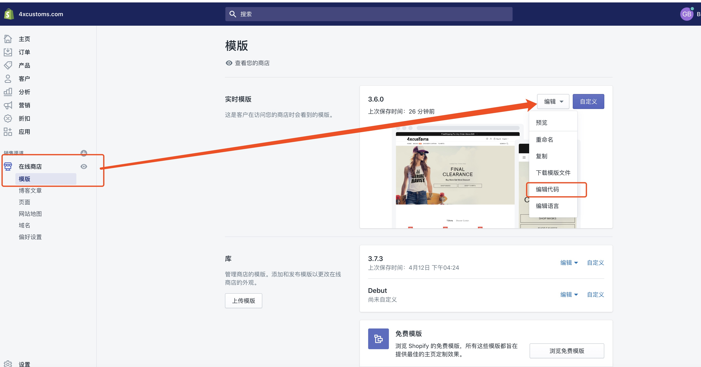
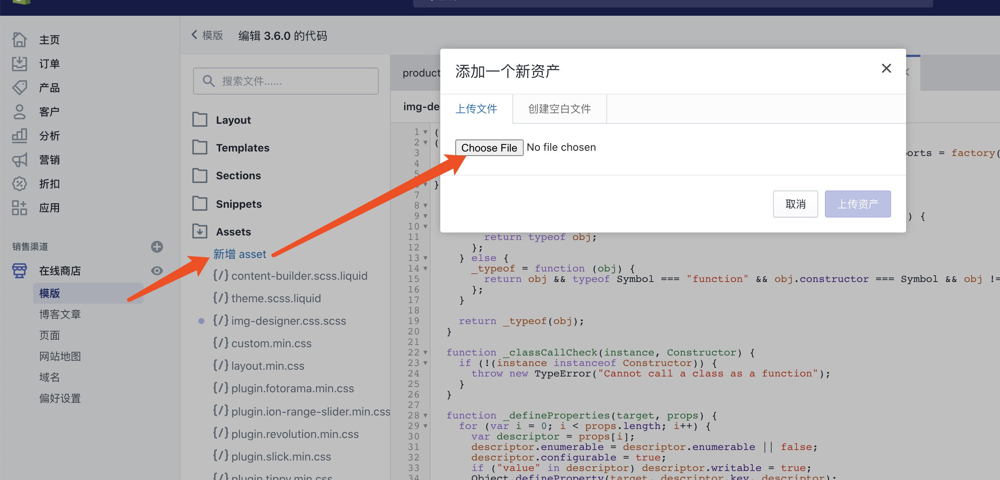
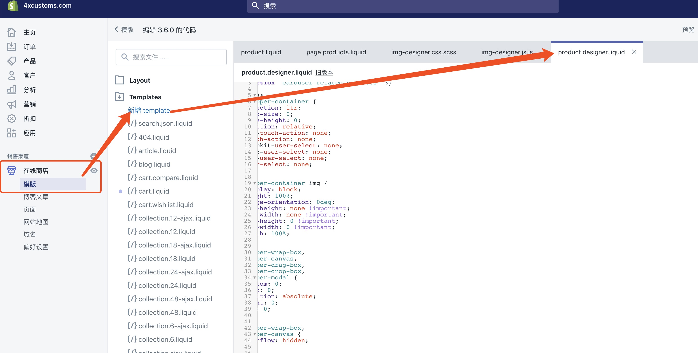
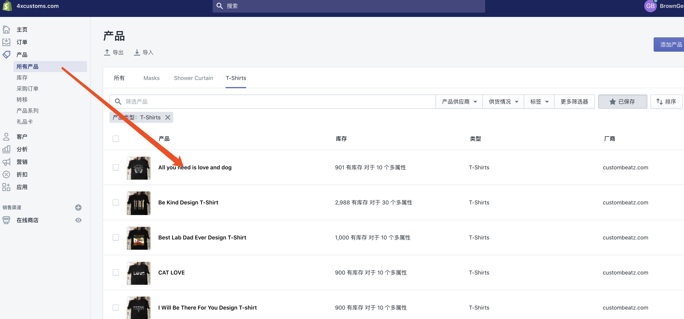
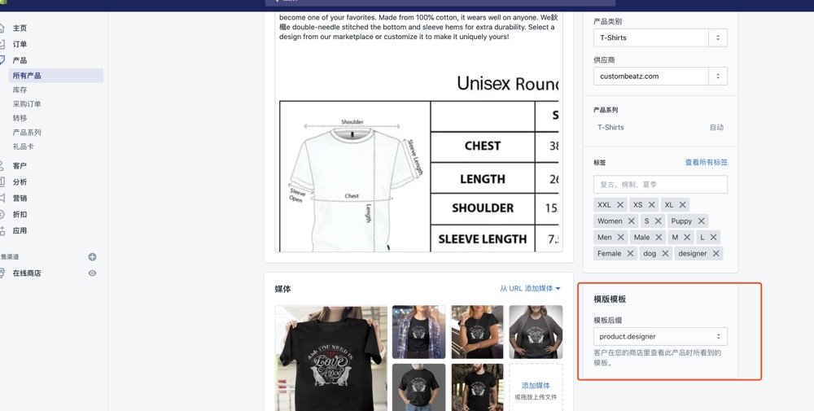
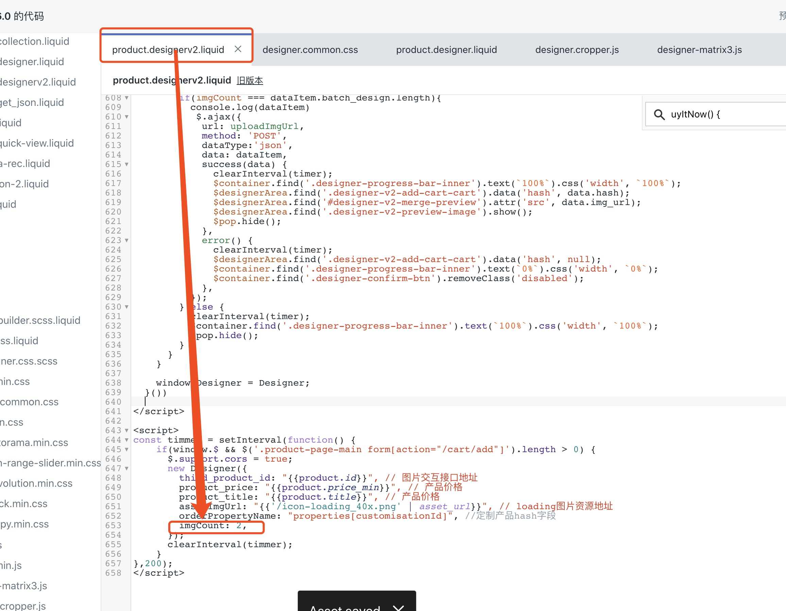

# shopify设计器第一版

### 使用指南
  1. 进入 shopify 后台代码编辑
    
  2. 将本项目 `./fonts` 中文件全部加到 `asset` 中( 四个字体文件和一张图片 )  
  3. 将本项目中 `./js` 和 `./css` 加到 `asset` 中  
  
  4. 在 shopify 后台, 新建模板文件 `product.designer.liquid`，将本项目 `./templates/designer.v1.liquid` 文件代码复制到里面。  
  
  5. 编辑产品，定制产品模板文件切换为 `product.designer.liquid`  
  
  


### 配置参数说明
```javascript
{
  {
    uploadImgUrl: 'http://snb.lichengxx.cn/api/product',
    orderPropertyName: 'properties[customisationId]',
    width: 500, // 设计区域大小
    height: 500, // 设计区域大小
    viewerRatio: 1.5, // 可视区域高宽比
    angleStep: 15, // 单次旋转角度
    // 可视文本配置
    textConfig: {
      uploadLabel: 'Upload Your Photo', // 图片上传按钮提示语
      upload: 'upload', // 图片上传按钮
      popTitle: '', // 弹窗标题
      imgPopTitle: '', // 图片预览弹窗标题
      designerTips: '', // 设计提示
      popCancel: 'Cancel', // 取消按钮文本
      popConfirm: 'Confirm', // 确认按钮文本
    }
  }
}

```

# 接口说明
- 接口地址： 配置项里的 uploadImgUrl
- 接口参数： 
```javascript
img_data, // 图片源数据
image_width, // 图片在画布里面的宽
image_height, // 图片在画布里面的高
image_top, // 图片中心距离画布左顶点
image_left, // 图片中心距离画布左顶点
image_angle, // 图片绕中心旋转的角度（顺时针角度）
design_params_width, // 裁剪窗宽度
design_params_height, // 裁剪窗高度
design_params_top, // 裁剪窗左顶点距离画布左顶点高
design_params_left, // 裁剪窗左顶点距离画布左顶点宽
third_product_id, // shopify 产品id

// 返回值
data: {
  hash, // 放入 shopify 订单中属性中（属性名：配置项的 orderPropertyName）
}
```


# shopify设计器第二版


# 使用指南
**与第一版使用方法雷同**
第 4 步改为：新建模板文件 `product.designer.v2.liquid`，将本项目 `designer.v2.liquid` 文件代码复制到里面  
第 5 步改为： 编辑产品，定制产品模板文件切换为 `product.designer.v2.liquid`  

**注意点，不同的图片数要求，需要自行增加模板配置配置：**



# 配置参数说明
```javascript
{
  {
    uploadImgUrl: 'http://snb.lichengxx.cn/api/product/design', // 定制图片交互地址
    getAliPramsUrl: 'https://snb.lichengxx.cn/api/ossUpload', // 获取阿里云参数地址
    uploadAliImgUrl: 'https://snb-bucket.oss-cn-hangzhou.aliyuncs.com/', // 阿里云上传地址
    imgCount: 2, // 用户需要上传的图片数量
    third_product_id: 0, // 第三方产品ID
    product_price: 1000, // 第三方产品价格
    product_title: '', // 第三方产品标题
    assetImgUrl: '/', // 静态图片资源地址
    orderPropertyName: "properties[customisationId]", // 定制产品hash字段
    width: 500, // 设计区域大小
    height: 500, // 设计区域大小
    viewerRatio: 1.5, // 可视区域高宽比
    angleStep: 15, // 单次旋转角度
    // 可视文本配置
    textConfig: {
      designerBtnText: 'CUSTOMIZE NOW', // 定制按钮文本
      uploadLabel: 'Upload Your Photo', // 图片上传按钮提示语
      upload: 'upload', // 图片上传按钮
      popTitle: '', // 弹窗标题
      imgPopTitle: '', // 图片预览弹窗标题
      designerTips: '', // 设计提示
      popCancel: 'Cancel', // 取消按钮文本
      popConfirm: 'Confirm', // 确认按钮文本
      addToCartText: "Add to cart", //加入购物车文本
      buyItNowText: "Buy it now", //加入购物车文本
    }
  }
}

```

# 接口说明
- 接口地址： 配置项里的 uploadImgUrl
- 接口参数： 
```javascript
{
  batch_design: [
    image_params: {
      width, // 图片在画布里面的宽
      height, // 图片在画布里面的高
      top, // 图片中心距离画布左顶点
      left, // 图片中心距离画布左顶点
      angle, // 图片绕中心旋转的角度
      oss_file_id
    },
    design_params:{
      width, // 裁剪窗宽度
      height, // 裁剪窗高度
      top, // 裁剪窗左顶点距离画布左顶点高
      left, // 裁剪窗左顶点距离画布左顶点高
    }
  ]
}

// 返回值
data: {
  hash, // 放入 shopify 订单中属性中（属性名：配置项的 orderPropertyName）
  image_src, // 合成图地址
}
```